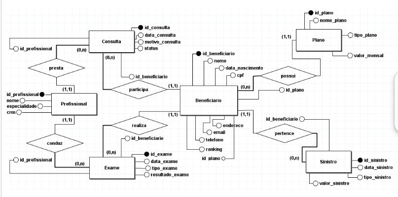

# ByteRisk - Sistema de Redução de Sinistros Odontológicos

## 1. Nome da Aplicação

**ByteRisk** - Sistema de classificação e redução de sinistros odontológicos

---

## 2. Integrantes do Grupo

- **Felipe Arcanjo Matos dos Anjos (RM554018)** - Desenvolvimento backend, implementação da lógica de negócios em **Java com Spring Boot**, integração com **Oracle Database** e desenvolvimento das APIs REST.
- **Marcelo Vieira Junior (RM553640)** - Documentação do projeto e elaboração dos diagramas.

---

## 3. Arquitetura da Solução

A solução segue o padrão arquitetural **MVC (Model-View-Controller)** e é baseada no **Spring Boot**. Os principais componentes incluem:

- **Camada de Model**: Representação das entidades do domínio, incluindo **Beneficiário**.
- **Camada de Repository**: Interfaces de acesso ao banco de dados utilizando **Spring Data JPA**.
- **Camada de Service**: Contém a lógica de negócios e integrações com stored procedures.
- **Camada de Controller**: Exposição de endpoints REST e renderização de páginas com **Thymeleaf**.
- **Banco de Dados**: Utilização do **Oracle Database** para persistência de dados.
- **Front-End**: Implementado com **Thymeleaf** para renderização dinâmica das páginas HTML.

## 4. Como Rodar a Aplicação

### 4.1 Pré-requisitos

- **Java 17**
- **Maven**
- **Docker e Docker Compose**
- **Oracle Database** (ou instância local/nuvem)

### 4.2 Passos para execução

1. Clone o repositório:
   ```bash
   git clone https://github.com/usuario/repo.git
   cd repo
   ```

2. Instale as dependências e compile o projeto:
   ```bash
   mvn clean install
   ```

3. Configure as credenciais de acesso ao banco de dados no arquivo `application.properties`.

4. Para rodar a aplicação utilizando Docker Compose:
   ```bash
   docker-compose up -d
   ```

5. Acesse a aplicação no navegador:
   ```
   http://localhost:8080/view/beneficiarios
   ```

---

## 5. Desenvolvimento

### 5.1 Funcionalidades Implementadas

- **CRUD de Beneficiários** (Criação, Listagem, Atualização e Exclusão)
- **Validação de CPF e E-mail antes da inserção**
- **Integração com Oracle Database via stored procedures**
- **Interface web interativa usando Thymeleaf**
- **Estilização do front-end para melhor experiência do usuário**
- **Navbar e Footer reutilizáveis para padronização das páginas**

### 5.2 Testes Realizados

Os testes foram realizados diretamente na aplicação web. Todas as funcionalidades do CRUD foram testadas manualmente, incluindo:

- Inserção de um novo beneficiário.
- Edição de um beneficiário existente.
- Exclusão de beneficiários cadastrados.
- Listagem de todos os beneficiários.

---
   
# Configuração do Banco de Dados

### Configurações do JPA e Hibernate

- spring.jpa.hibernate.ddl-auto=create
- spring.jpa.database-platform=org.hibernate.dialect.OracleDialect
- spring.jpa.show-sql=true

### Habilita o console do H2 (se for necessário para testes locais)
- spring.h2.console.enabled=true

## 6. Diagramas

### 6.1 Diagrama de Classes

### 6.2 Diagrama ER

### Diagrama de Entidade e Relacionamento


---

## 7. Link para o Vídeo de Apresentação

[Link para o vídeo de apresentação](https://youtu.be/0qrVv2i0Zao)

---

## 8. Próximos Passos

- **Validação avançada de entrada de dados** para evitar erros de inserção.
- **Melhoria na experiência do usuário (UX/UI)** com estilos mais modernos.
- **Testes unitários e de integração automatizados** com **JUnit** e **Mockito**.

---